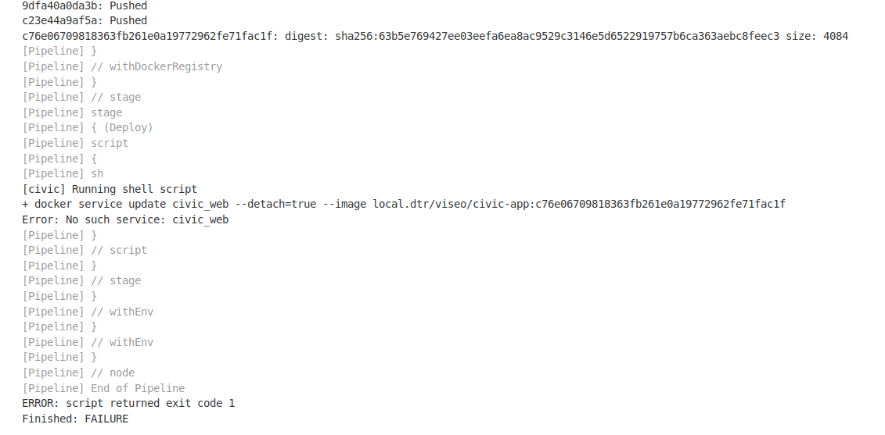

## Setup Continous Integration - Jobs

## Jenkins
1. Add plugin **CloudBees Docker Build and Publish plugin**

2. Create Jenkins user credentials for the Docker Truested Registry
    - On the Jenkins front page, click on Credentials -> System -> Global credentials -> Add Credentials
3. Use the ID **dtr-credentials** with user/pass *jenkins/password*

## Job: Civic App

1. Create a new job: *Jenkins* > *New Item* >
    - Name: civic
    - Select 'Pipeline' for type
    - Click 'OK'
4. Scroll down to **Pipeline** and select *Pipeline script from SCM* for the Definition
    - Select *Git* for the **SCM**
    - Repository URL = *https://github.com/viseo-asia/blockchain-civic-demo.git*
    - Click **Save**
5. Click **Build Now**

**Note** The initial build will fail right at the end as the Docker Stack is not yet deployed- that's next step...

## Job: Demo Web App

Similar step to above...

1. Create a new job: *Jenkins* > *New Item* >
    - Name: demo-web-app
    - Select 'Pipeline' for type
    - Click 'OK'
4. Scroll down to **Pipeline** and select *Pipeline script from SCM* for the Definition
    - Select *Git* for the **SCM**
    - Repository URL = *https://github.com/viseo-asia/demo-web-app.git*
    - Click **Save**
5. Click **Build Now**

**Note** The initial build will fail right at the end as the Docker Stack is not yet deployed- that's next step...

